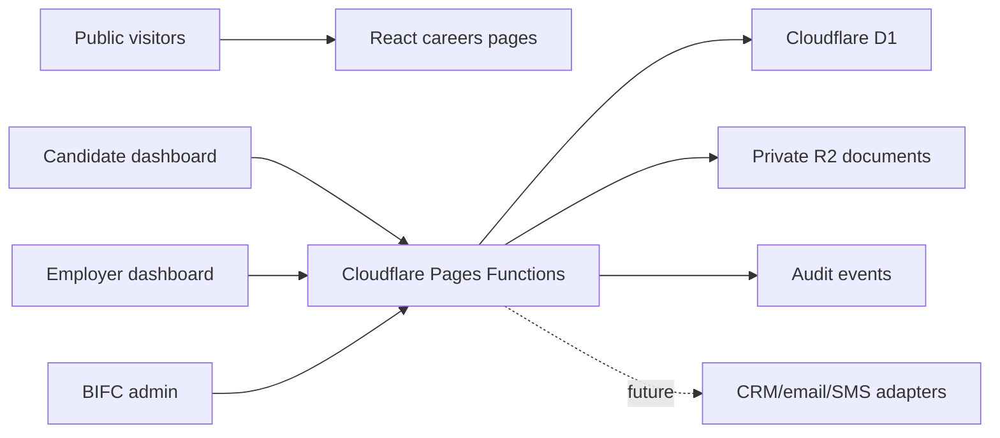

# BIFC Careers Architecture

The chosen architecture is a hybrid application mounted inside the existing website. Public careers pages use the current BIFC design and navigation. Protected workflows use Pages Functions so permissions are enforced server-side.

Core rule: the browser never receives locked candidate fields unless the server has confirmed the actor, role, employer, job, candidate permission and disclosure state.

