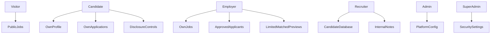

# BIFC Careers Permissions

Server-side rules:

- Employers cannot query unrestricted candidates.
- Employers can only view limited previews connected to eligible active jobs.
- Candidate contact details, documents and exact location stay locked until approved.
- Candidates cannot see employer-only or BIFC-only notes.
- Employers cannot see BIFC internal recruitment notes.
- Admin and recruiter access must be role-based and logged.

