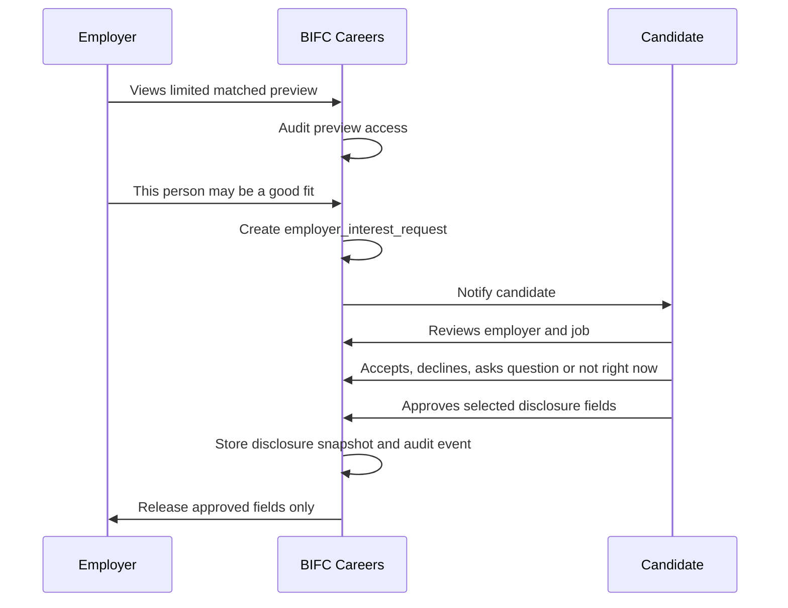

# BIFC Careers Privacy Flow

```mermaid
sequenceDiagram
  participant E as Employer
  participant B as BIFC Careers
  participant C as Candidate
  E->>B: Views limited matched preview
  B->>B: Audit preview access
  E->>B: This person may be a good fit
  B->>B: Create employer_interest_request
  B->>C: Notify candidate
  C->>B: Reviews employer and job
  C->>B: Accepts, declines, asks question or not right now
  C->>B: Approves selected disclosure fields
  B->>B: Store disclosure snapshot and audit event
  B->>E: Release approved fields only
```

Acceptance of interest does not automatically release optional contact details. Direct contact information is a later candidate-controlled disclosure.

